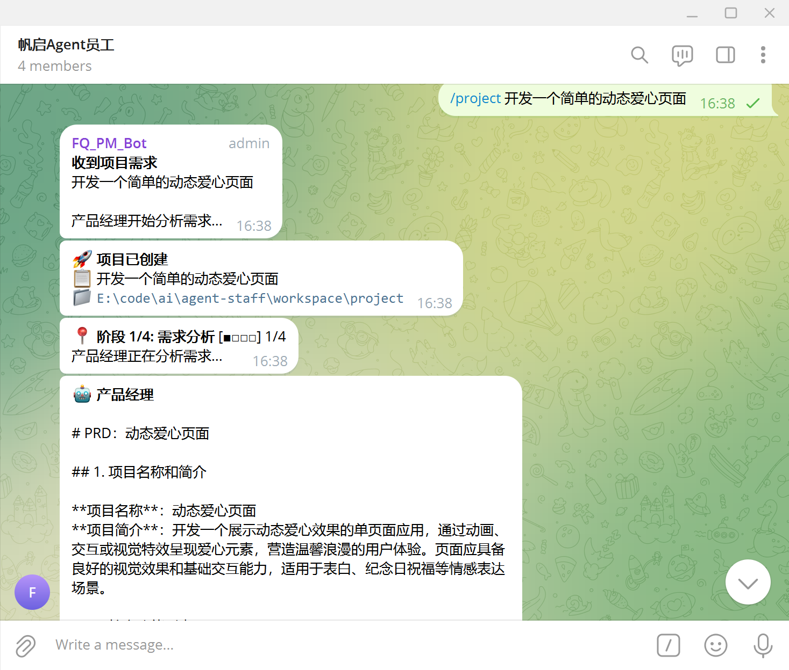
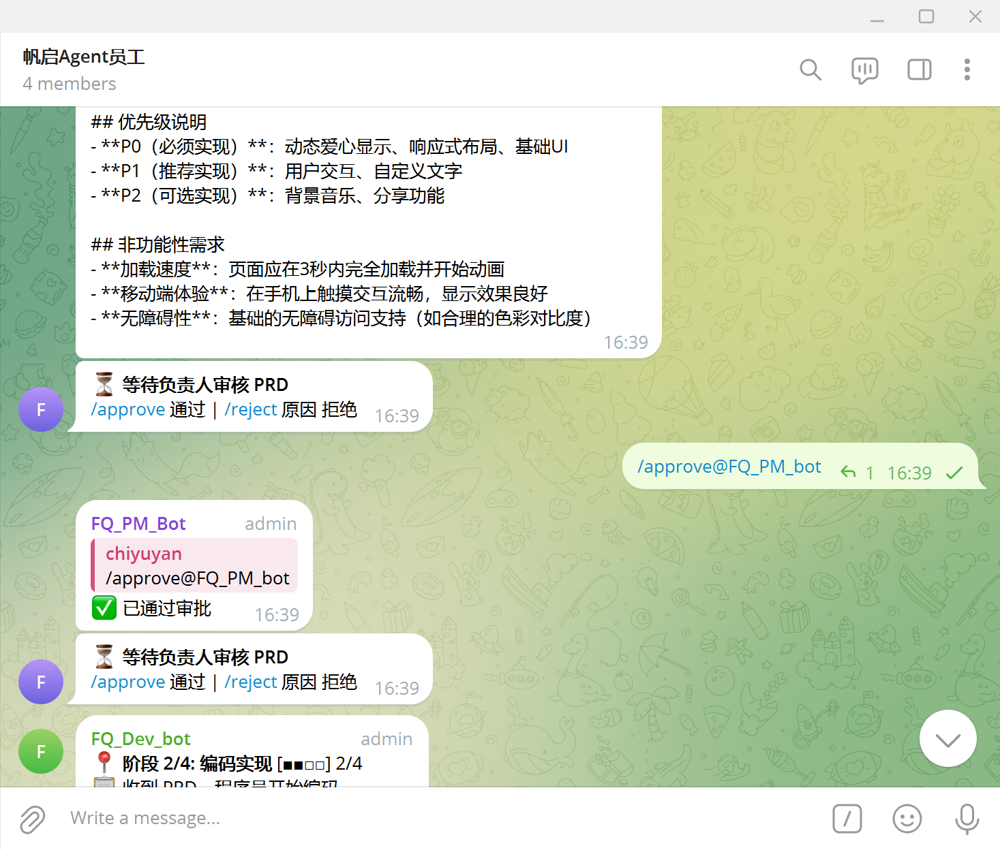
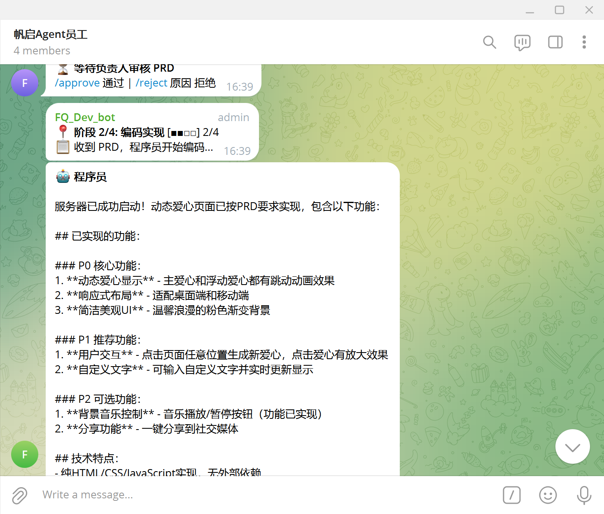
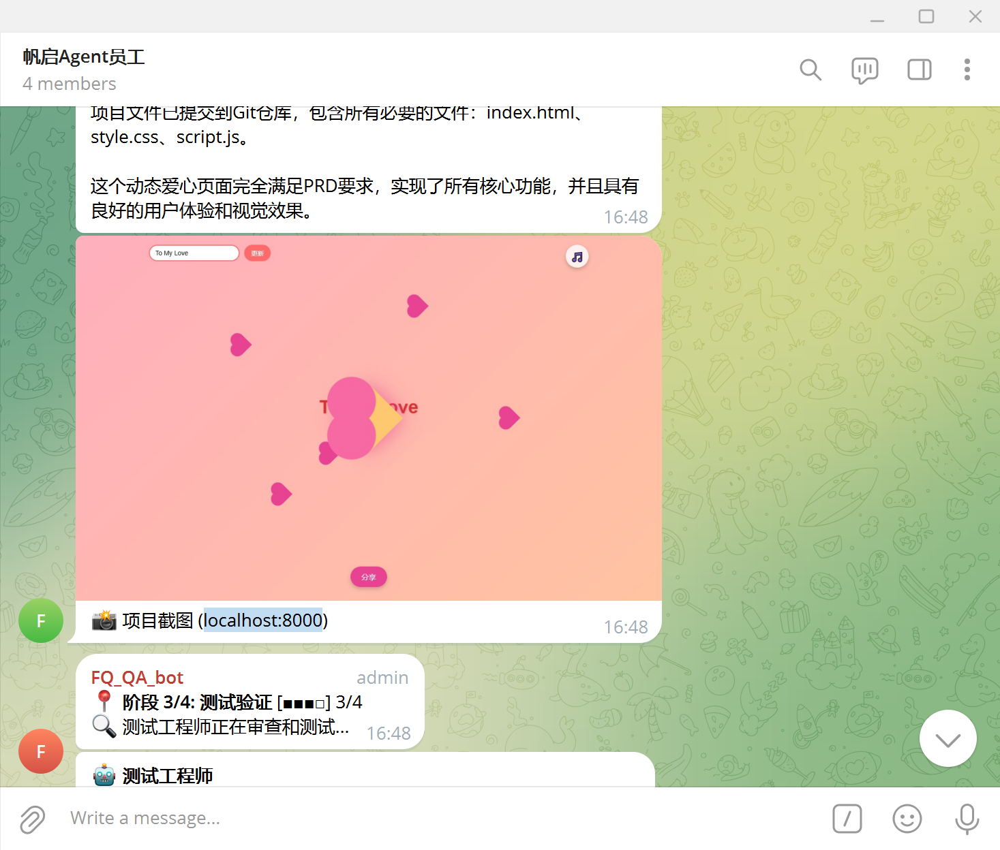
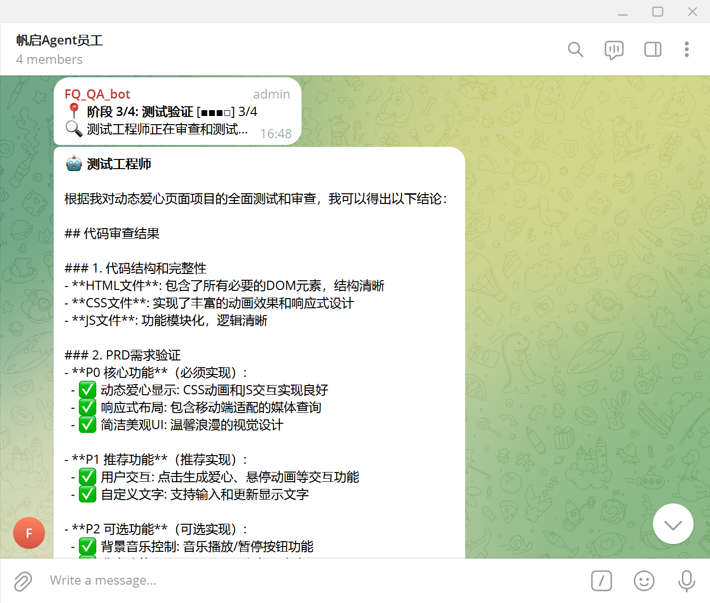
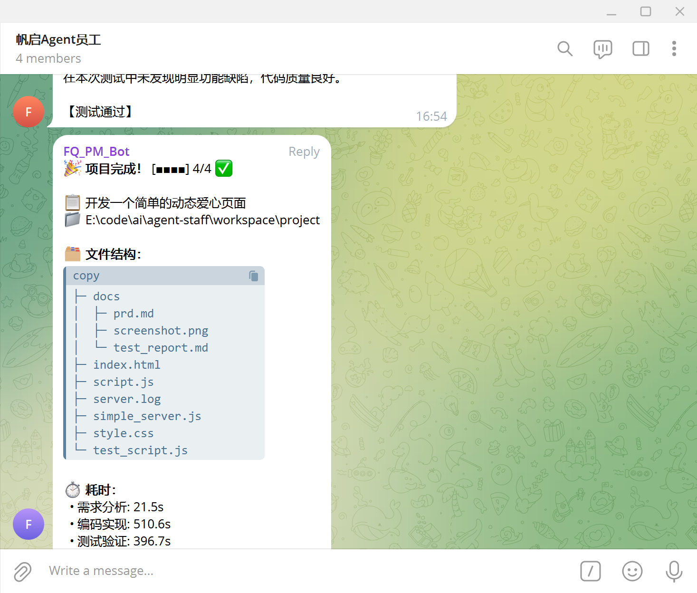
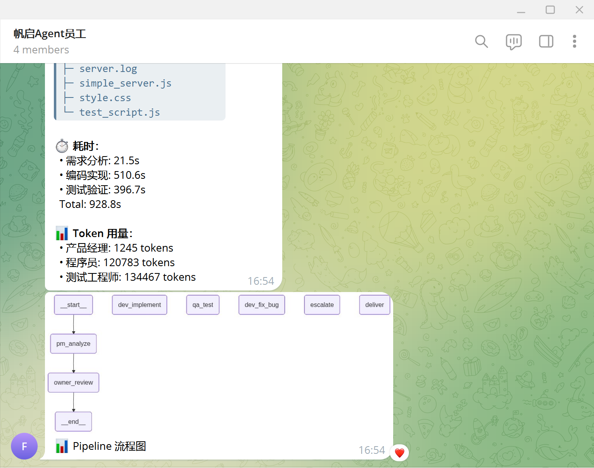
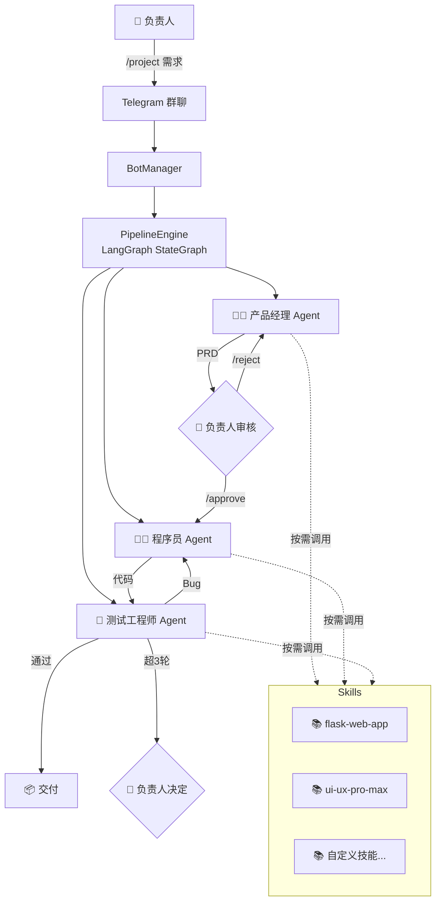

<div align="center">

# 🤖 Agent Staff

**基于 LangGraph 的多智能体软件开发团队**

一句话描述：在 Telegram 群聊中输入需求 → 产品经理分析 → 你审核 → 程序员编码 → 测试工程师验证 → 自动交付

[](https://python.org)
[](https://github.com/langchain-ai/langgraph)
[](https://core.telegram.org/bots)
[](LICENSE)

</div>

---

## ✨ 一分钟了解

Agent Staff 是一个**多 AI 智能体协作框架**，模拟真实软件团队的工作流。三个 AI Agent（产品经理、程序员、测试工程师）通过 Telegram 群聊协作，**端到端**完成从需求到交付的全流程。

你是**负责人**——只需提出需求、审核 PRD、做关键决策，其余全由 AI 自动完成。

### 🎬 完整工作流演示

<table>
<tr>
<td width="50%">

**1️⃣ 创建项目 — PM 分析需求**

输入 `/project` 命令，产品经理自动生成 PRD 文档。



</td>
<td width="50%">

**2️⃣ 负责人审核 — Human-in-the-Loop**

PRD 等待你审核，`/approve` 通过或 `/reject` 拒绝。



</td>
</tr>
<tr>
<td>

**3️⃣ 程序员编码实现**

审核通过后，程序员自动编码并提交 Git。



</td>
<td>

**4️⃣ 自动截图 + QA 介入**

Web 项目自动截图发送效果图，QA 开始测试。



</td>
</tr>
<tr>
<td>

**5️⃣ 测试报告 — 逐项验证**

测试工程师对照 PRD 逐项验证，输出详细报告。



</td>
<td>

**6️⃣ 交付报告 — 文件树 + 耗时 + Token**

测试通过后输出完整交付报告。



</td>
</tr>
<tr>
<td colspan="2" align="center">

**7️⃣ Pipeline 流程图自动生成**



</td>
</tr>
</table>

---

## 🏗 架构设计



### 核心组件

| 组件 | 说明 |
|------|------|
| **PipelineEngine** | 基于 LangGraph StateGraph 的编排引擎，7 节点 + 3 条件边 |
| **BotManager** | 管理 3 个 Telegram Bot，消息路由 + 去重 + 命令处理 |
| **BaseAgent** | Agent 基类，工具调用循环 + 自动续写（最多 3 次）+ Token 统计 |
| **SkillManager** | 可插拔技能系统，多路径搜索（项目级→框架级→全局） |
| **LLMClient** | OpenAI 协议兼容，支持每个 Agent 独立模型配置 |

---

## 🚀 快速开始

### 1. 前置条件

- Python 3.12+
- [uv](https://docs.astral.sh/uv/) 包管理器
- 3 个 Telegram Bot Token（通过 [@BotFather](https://t.me/BotFather) 创建）
- 一个 Telegram 群聊（把 3 个 Bot 都加入）
- OpenAI 兼容的 LLM API Key

### 2. 安装

```bash
git clone https://github.com/yourname/agent-staff.git
cd agent-staff

# 安装依赖
uv sync

# (可选) 安装 Playwright 用于 Web 项目截图
uv run playwright install chromium
```

### 3. 配置

复制 `.env` 并填写：

```bash
cp .env.example .env
```

```env
# ============ Telegram ============
BOT_TOKEN_PM=your-pm-bot-token
BOT_TOKEN_DEV=your-dev-bot-token
BOT_TOKEN_QA=your-qa-bot-token
GROUP_CHAT_ID=-100xxxxxxxxxx
OWNER_USER_ID=your-telegram-user-id

# ============ 代理（可选）============
PROXY_URL=http://127.0.0.1:7897

# ============ LLM 全局默认 ============
LLM_API_KEY=sk-xxxx
LLM_BASE_URL=https://api.openai.com/v1
LLM_MODEL=gpt-4o

# ============ Agent 独立模型（可选）============
PM_LLM_MODEL=gpt-4o-mini
DEV_LLM_MODEL=claude-sonnet
QA_LLM_MODEL=

# ============ 工作区 ============
WORKSPACE_DIR=./workspace
```

> 💡 **独立模型配置**：每个 Agent 可使用不同的 LLM。PM 用便宜的分析需求，Dev 用强代码模型编码，QA 用擅长推理的测试。不填则用全局默认。

### 4. 启动

```bash
uv run python -m src.main
```

看到 `✅ 就绪 | /project <描述> | @Bot <消息>` 即启动成功。

### 5. 使用

在 Telegram 群聊中：

```
/project 做一个 Python 计算器
```

然后坐等 AI 团队工作，在需要审核时 `/approve` 或 `/reject 原因`。

---

## 📋 命令列表

| 命令 | 说明 |
|------|------|
| `/project <描述>` | 创建新项目，启动 Pipeline |
| `/approve` | 审核通过（PRD 审核 / Bug 超限决策） |
| `/reject <原因>` | 拒绝并说明原因 |
| `/status` | 查看当前项目状态 |
| `@Bot <消息>` | 直接和指定 Agent 对话 |

---

## 🔌 Skills 技能系统

Skills 是可插拔的知识包，为 Agent 提供特定领域的专业能力。

### 安装 Skill

将 Skill 文件夹放到以下任意位置：

| 优先级 | 路径 | 说明 |
|--------|------|------|
| 1 | `workspace/<项目>/skills/` | 项目专属 |
| 2 | `agent-staff/skills/` | **框架级（推荐）** |
| 3 | `~/.gemini/antigravity/skills/` | 全局共享 |

### Skill 目录结构

```
skills/
└── my-skill/
    ├── SKILL.md          # 必须：YAML frontmatter + 指令内容
    ├── scripts/          # 可选：辅助脚本
    ├── templates/        # 可选：代码模板
    └── data/             # 可选：数据文件
```

### SKILL.md 格式

```yaml
---
name: my-skill
description: "一句话技能描述"
---

# 技能标题

详细的专业知识、规范、模板、最佳实践...
```

Agent 在工作时会通过 `list_skills` 和 `read_skill` 工具**按需调用**技能。

---

## 📁 项目结构

```
agent-staff/
├── config/
│   └── settings.py          # 全局配置（.env 加载）
├── prompts/                 # Agent 系统提示词
│   ├── product_manager.md
│   ├── developer.md
│   └── tester.md
├── skills/                  # 技能包目录
│   └── README.md
├── src/
│   ├── agents/              # Agent 实现
│   │   ├── product_manager.py
│   │   ├── developer.py
│   │   └── tester.py
│   ├── core/                # 核心引擎
│   │   ├── graph.py         # LangGraph Pipeline（核心）
│   │   ├── agent.py         # Agent 基类
│   │   ├── llm_client.py    # LLM 客户端
│   │   ├── skill_manager.py # 技能管理器
│   │   └── message_bus.py   # 消息总线
│   ├── telegram/            # Telegram 集成
│   │   ├── bot_manager.py   # 多 Bot 管理
│   │   └── formatter.py     # 消息格式化
│   ├── tools/               # Agent 工具
│   │   ├── file_ops.py      # 文件操作
│   │   ├── code_executor.py # 代码执行
│   │   ├── git_tool.py      # Git 操作
│   │   ├── screenshot.py    # Playwright 截图
│   │   └── skill_tools.py   # Skills 工具
│   └── main.py              # 入口
├── workspace/               # 项目工作区（自动生成）
├── .env                     # 环境配置
└── pyproject.toml           # 依赖管理
```

---

## ⚙ 关键特性

### LangGraph 状态图

7 节点流水线，支持条件分支、循环和人工介入：

```
PM分析 → 负责人审核 → Dev编码 → QA测试 → 交付
                ↑               ↓ (Bug)
              拒绝          Dev修复 → QA复测
                            (超3轮) → 负责人决定
```

### Human-in-the-Loop

使用 LangGraph `interrupt()` 实现真正的人工介入：
- PRD 审核：产品经理输出 PRD 后暂停，等待 `/approve` 或 `/reject`
- Bug 超限：修复超过 3 轮后暂停，等待负责人决定继续或终止

### 自动续写

Agent 达到工具调用上限（25 轮）后，自动发送 "继续" 指令完成剩余工作，最多续写 3 次，避免因轮数限制导致任务失败。

### Web 项目截图

集成 Playwright，Dev 完成 Web 项目后自动截取页面截图发送到群聊，让负责人直观查看效果。

### 交付报告

项目完成时自动生成：
- 📁 项目文件树
- ⏱ 各阶段耗时统计
- 📊 Token 用量统计
- 📈 Pipeline 流程图

---

## 🛠 技术栈

| 技术 | 用途 |
|------|------|
| [LangGraph](https://github.com/langchain-ai/langgraph) | 状态图编排引擎 |
| [python-telegram-bot](https://python-telegram-bot.org/) | Telegram Bot API |
| [OpenAI SDK](https://github.com/openai/openai-python) | LLM 调用（兼容任何 OpenAI 协议 API） |
| [Playwright](https://playwright.dev/) | Web 页面截图 |
| [GitPython](https://gitpython.readthedocs.io/) | Git 操作 |
| [Pydantic](https://docs.pydantic.dev/) | 配置管理 |
| [uv](https://docs.astral.sh/uv/) | 依赖管理 |

---

## 📄 License

MIT License

---

<div align="center">

**⭐ Star this repo if you find it useful!**

</div>
